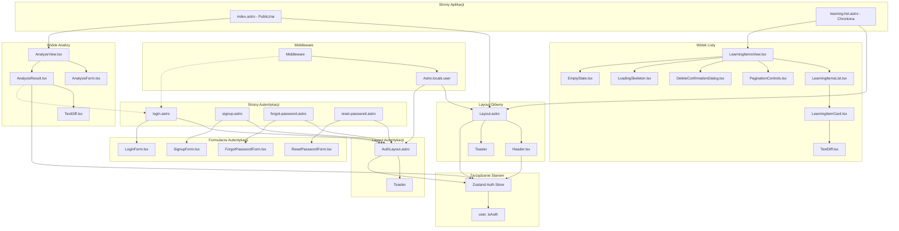

```mermaid
flowchart TB
    subgraph "Middleware"
        MW[Middleware]
        MW --> LOCALS[Astro.locals.user]
    end

    LOCALS --> LAYOUT
    LOCALS --> AUTHLAYOUT

    subgraph "Zarządzanie Stanem"
        STORE[Zustand Auth Store]
        STORE --> STOREDATA[user, isAuth]
    end

    subgraph "Layout Główny"
        LAYOUT[Layout.astro]
        LAYOUT --> HEADER[Header.tsx]
        LAYOUT --> TOASTER1[Toaster]
    end

    LAYOUT --> STORE
    HEADER --> STORE

    subgraph "Layout Autentykacji"
        AUTHLAYOUT[AuthLayout.astro]
        AUTHLAYOUT --> TOASTER2[Toaster]
    end

    AUTHLAYOUT --> STORE

    subgraph "Strony Aplikacji"
        INDEXPAGE[index.astro - Publiczna]
        LEARNINGPAGE[learning-list.astro - Chroniona]
    end

    INDEXPAGE --> LAYOUT
    LEARNINGPAGE --> LAYOUT
    MW -.-> LOGINPAGE

    subgraph "Widok Analizy"
        ANALYZEVIEW[AnalyzeView.tsx]
        ANALYZEVIEW --> ANALYSISFORM[AnalysisForm.tsx]
        ANALYZEVIEW --> ANALYSISRESULT[AnalysisResult.tsx]
        ANALYSISRESULT --> TEXTDIFF1[TextDiff.tsx]
    end

    INDEXPAGE --> ANALYZEVIEW
    ANALYSISRESULT --> STORE
    ANALYSISRESULT -.-> LOGINPAGE

    subgraph "Widok Listy"
        LEARNINGVIEW[LearningItemsView.tsx]
        LEARNINGVIEW --> LEARNINGLIST[LearningItemsList.tsx]
        LEARNINGVIEW --> PAGINATION[PaginationControls.tsx]
        LEARNINGVIEW --> DELETEDIALOG[DeleteConfirmationDialog.tsx]
        LEARNINGVIEW --> LOADINGSKEL[LoadingSkeleton.tsx]
        LEARNINGVIEW --> EMPTYSTATE[EmptyState.tsx]
        LEARNINGLIST --> LEARNINGCARD[LearningItemCard.tsx]
        LEARNINGCARD --> TEXTDIFF2[TextDiff.tsx]
    end

    LEARNINGPAGE --> LEARNINGVIEW

    subgraph "Strony Autentykacji"
        LOGINPAGE[login.astro]
        SIGNUPPAGE[signup.astro]
        FORGOTPAGE[forgot-password.astro]
        RESETPAGE[reset-password.astro]
    end

    LOGINPAGE --> AUTHLAYOUT
    SIGNUPPAGE --> AUTHLAYOUT
    FORGOTPAGE --> AUTHLAYOUT
    RESETPAGE --> AUTHLAYOUT

    subgraph "Formularze Autentykacji"
        LOGINFORM[LoginForm.tsx]
        SIGNUPFORM[SignupForm.tsx]
        FORGOTFORM[ForgotPasswordForm.tsx]
        RESETFORM[ResetPasswordForm.tsx]
    end

    LOGINPAGE --> LOGINFORM
    SIGNUPPAGE --> SIGNUPFORM
    FORGOTPAGE --> FORGOTFORM
    RESETPAGE --> RESETFORM
```
