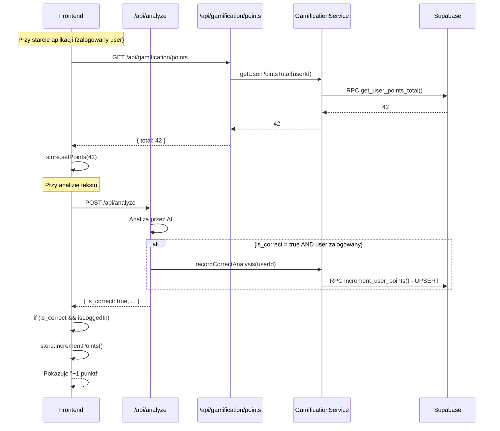

# Gamifikacja - licznik poprawnych analiz

## Podsumowanie wymagań

- Automatyczna inkrementacja po analizie z `is_correct: true`
- Wyświetlanie w nagłówku (suma punktów) + przy wyniku analizy ("+1 punkt!")
- Prosty licznik punktów per użytkownik (upsert z inkrementacją)
- Tylko dla zalogowanych użytkowników

## Architektura



## 1. Baza danych - tabela `user_points`

Tabela przechowująca licznik punktów per użytkownik (jeden wiersz na użytkownika):

```sql
CREATE TABLE user_points (
  user_id uuid PRIMARY KEY REFERENCES auth.users(id) ON DELETE CASCADE,
  points integer NOT NULL DEFAULT 0,
  updated_at timestamptz NOT NULL DEFAULT now()
);
```

RLS policies - użytkownik widzi tylko swoje punkty (SELECT dla authenticated).

Funkcja RPC do atomowej inkrementacji (upsert):

```sql
CREATE FUNCTION increment_user_points(target_user_id uuid)
RETURNS integer AS $$
  INSERT INTO user_points (user_id, points, updated_at)
  VALUES (target_user_id, 1, now())
  ON CONFLICT (user_id)
  DO UPDATE SET 
    points = user_points.points + 1,
    updated_at = now()
  RETURNING points;
$$ LANGUAGE sql SECURITY DEFINER;
```

Funkcja RPC do pobierania sumy:

```sql
CREATE FUNCTION get_user_points_total(target_user_id uuid)
RETURNS integer AS $$
  SELECT COALESCE(
    (SELECT points FROM user_points WHERE user_id = target_user_id),
    0
  );
$$ LANGUAGE sql SECURITY DEFINER;
```

## 2. Backend

### 2.1 Nowy serwis `GamificationService`

Lokalizacja: [`src/lib/services/gamification/`](src/lib/services/)

- `recordCorrectAnalysis(userId)` - atomowy upsert przez RPC `increment_user_points`, zwraca nową sumę
- `getUserPointsTotal(userId)` - pobiera sumę punktów przez RPC `get_user_points_total`

### 2.2 Modyfikacja endpointu `/api/analyze`

W [`src/pages/api/analyze/index.ts`](src/pages/api/analyze/index.ts):

1. Po udanej analizie z `is_correct: true` i gdy `locals.user` istnieje
2. Wywołaj `GamificationService.recordCorrectAnalysis(userId)`
3. Nie modyfikujemy odpowiedzi - frontend sam wnioskuje o zdobytym punkcie

### 2.3 Nowy endpoint `/api/gamification/points`

- `GET` - zwraca `{ total: number }` dla zalogowanego użytkownika
- Zwraca 401 dla niezalogowanych
- Używany do inicjalizacji stanu w nagłówku przy starcie aplikacji

## 3. Frontend

### 3.1 Zustand store dla punktów

Nowy store `src/lib/stores/points.store.ts` (wzorowany na [`auth.store.ts`](src/lib/stores/auth.store.ts)):

- `points: number | null` (null = niezalogowany lub nie pobrano jeszcze)
- `setPoints(n)` - ustawia wartość
- `incrementPoints()` - inkrementuje o 1

### 3.2 Inicjalizacja punktów

W komponencie inicjalizującym (np. `PointsInitializer` lub rozszerzenie `AuthInitializer`):

- Przy starcie, jeśli user zalogowany, pobierz `GET /api/gamification/points`
- Zapisz wynik w store

### 3.3 Wyświetlanie w nagłówku

W [`src/components/Header.tsx`](src/components/Header.tsx):

- Ikona/badge z liczbą punktów obok avatara
- Tylko dla zalogowanych użytkowników (gdy `points !== null`)

### 3.4 Logika przy wyniku analizy

W komponencie obsługującym analizę:

- Po otrzymaniu `is_correct: true` i gdy user zalogowany:
  - Wywołaj `store.incrementPoints()`
  - Wyświetl animowany komunikat "Zdobywasz punkt!"

## Kolejność implementacji

1. Migracja bazy danych (tabela + RLS + RPC)
2. `GamificationService` w backend
3. Modyfikacja `/api/analyze` + nowy endpoint `/api/gamification/points`
4. Zustand store dla punktów
5. Inicjalizacja punktów przy starcie
6. UI w nagłówku
7. Komunikat "Zdobywasz punkt!" przy analizie